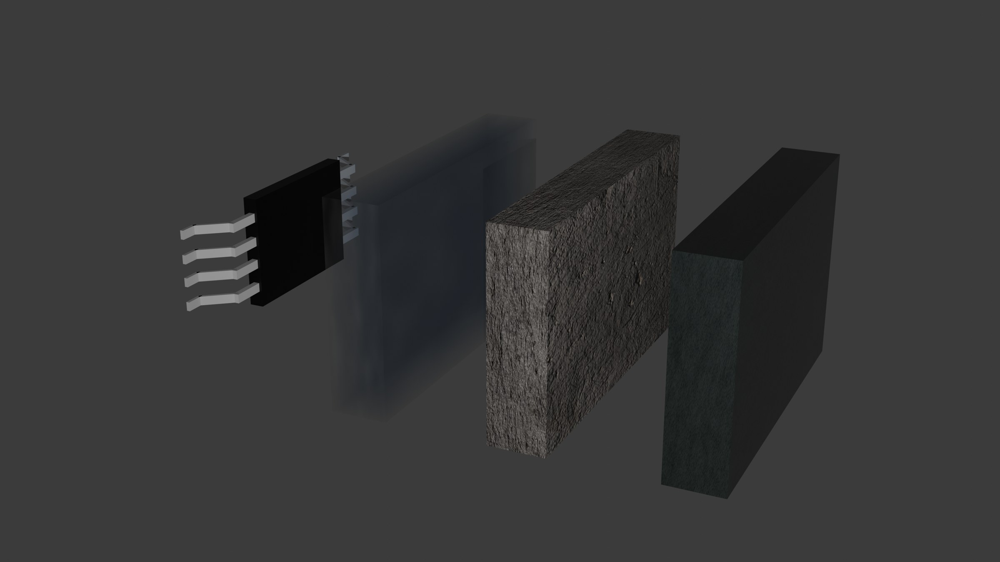

This page exists to break things. Every kind of block appears at least once, many appear in awkward company, and a few are deliberately too long, too narrow or too nested (if something looks wrong here, it will look wrong in a real post too). Footnotes[^short] should sit in the margin on wide screens, and a long one[^long] should not collide with its neighbour.[^close]

A paragraph with (one parenthetical), then (a nested one (inside another) to see whether the ink steps twice), then a parenthetical containing maths $(x, y) \in \R^2$ and `inline code (with brackets)`. A link to [another post](/writing/what-is-an-author) should open a live preview; a link to [an outside page](https://en.wikipedia.org/wiki/Knuth%E2%80%93Plass_line-breaking_algorithm) should not. Words like *italic*, **bold**, ***both***, ~~struck~~ and a very long unbreakable token: `aVeryLongIdentifierNameThatShouldNeverBreakAcrossLinesButMightOverflowTheColumn`.

## Boxes, all of them

> [!definition] metric space
> A *metric space* is a set $X$ with a map $d : X \times X \to [0, \infty)$ such that for all $x, y, z \in X$:
>
> 1. $d(x, y) = 0$ if and only if $x = y$;
> 2. $d(x, y) = d(y, x)$;
> 3. $d(x, z) \le d(x, y) + d(y, z)$.

> [!theorem] Heine–Borel
> A subset of $\R^n$ is compact if and only if it is closed and bounded.

> [!proof]
> Suppose $K \subseteq \R^n$ is closed and bounded. Then $K \subseteq [-M, M]^n$ for some $M$, and the cube is compact by repeated bisection. A closed subset of a compact set is compact.
>
> Conversely, a compact set is bounded (cover it by balls $B(0, k)$) and closed (a limit point outside it gives an open cover with no finite subcover).
>
> $$
> K \subseteq \bigcup_{k=1}^{\infty} B(0, k) \implies K \subseteq B(0, N).
> $$

> [!lemma]
> A box with no name, one line.

> [!proposition] a name that runs on for quite a while, longer than any name should, to see how the label wraps
> Short body.

> [!corollary]
> $\mathbb{N} \subset \mathbb{Z} \subset \mathbb{Q} \subset \mathbb{R} \subset \mathbb{C}$, and $\mathbb{\Gamma}$, $\mathbb{\Sigma}$ for the Greek fallback.

> [!example] every alphabet
> $\mathcal{A B C F L}$, $\mathscr{A B C F L}$, $\mathfrak{A B g h}$, $\mathbb{A B k 1}$, $\mathrm{d}x$, $\alpha\beta\gamma\,\Omega$.

> [!remark]
> A remark with a list:
>
> - one item
> - a second item with a footnote[^inbox]
>   - and a nested item
> - a third with `code`

> [!question] exercise
> Show that every convergent sequence in a metric space is Cauchy.

> [!answer]
> If $x_n \to x$, pick $N$ with $d(x_n, x) < \varepsilon/2$ for $n \ge N$. Then $d(x_m, x_n) \le d(x_m, x) + d(x, x_n) < \varepsilon$.

> [!question]
> A question with no answer after it stays an ordinary box.

> [!theorem]
> A theorem holding a code block and a quote.
>
> ```python
> print("inside a box")
> ```
>
> > a quote inside a theorem

## Quotes

> An ordinary excerpt, short.

> A long excerpt that goes on for several lines, to check the hairline and the size. Lorem ipsum is too obviously filler, so here is a sentence that keeps talking about itself, about its own length, about how it would like to end but cannot quite, because the test needs it to wrap at least four times on a wide screen and many more on a phone.
>
> And a second paragraph inside the same quote.

> The author is a modern figure, a product of our society.
> — Roland Barthes, *The Death of the Author*

> [!pull]
> A pull quote, large and centred, long enough to wrap onto a second line.

## Maths

Inline: $e^{i\pi} + 1 = 0$, $\sum_{n=1}^\infty \frac{1}{n^2} = \frac{\pi^2}{6}$, $\lVert x \rVert_p$, $f'(x)$, $x''$, $\int_a^b f$.

$$
\int_{-\infty}^{\infty} e^{-x^2}\,\mathrm{d}x = \sqrt{\pi}
$$

A display wide enough to scroll on a phone:

$$
\left( \sum_{k=1}^{n} a_k b_k \right)^{2} \le \left( \sum_{k=1}^{n} a_k^{2} \right) \left( \sum_{k=1}^{n} b_k^{2} \right) \quad\text{for all } a_1, \dots, a_n, b_1, \dots, b_n \in \R
$$

$$
\begin{aligned}
d(x, z) &\le d(x, y) + d(y, z) \\
        &\le 2 \max\{d(x, y), d(y, z)\}
\end{aligned}
\qquad
A = \begin{pmatrix} 1 & 2 \\ 3 & 4 \end{pmatrix}
$$

## Code

```haskell title="primes.hs" {3} ins={5} del={4}
-- marked line, inserted and deleted lines
primes :: [Int]
primes = sieve [2..]
  where sieve (p:xs) = p : sieve [x | x <- xs, x `mod` p /= 0]
  where sieve (p:xs) = p : sieve (filter ((/= 0) . (`mod` p)) xs)
```

```python showLineNumbers collapse={1-4} title="collapse.py"
import math
import itertools
import functools
import collections

def f(x):
    return math.sqrt(x)
```

```ts "highlighted text" /regex.*match/
const words = "highlighted text appears inside this line"
const re = /regex then a match/
```

```sh
npm install
npm run build
```

```text
A plain block with an extremely long line that does not wrap, to check horizontal scrolling and the scrollbar colour inside the frame ----------------------------------------------
```

```js wrap
// wrap: this one wraps instead of scrolling, even though the line is far too long to fit inside the column on any reasonable screen
```

```js title="long.js"
// over eight lines: should start folded
const a = 1
const b = 2
const c = 3
const d = 4
const e = 5
const f = 6
const g = 7
const h = 8
const i = 9
const j = 10
const k = 11
```

## Lists, tables, images

1. An ordered list.
2. With a second item that runs long enough to wrap onto a second line on most screens, so the hanging indent shows.
   1. Nested ordered.
   2. Nested again.
3. Third.

- [ ] a task
- [x] a done task

| Space | Complete | Compact |
| :---- | :------: | ------: |
| $\R$ | yes | no |
| $\Q$ | no | no |
| $[0, 1]$ | yes | yes |
| a cell with a long sentence that should wrap inside the table rather than push it wider than the column | maybe | — |



---

A horizontal rule above, and a last paragraph after it, ending on a footnote.[^last]

[^short]: Short.
[^long]: A long footnote, several lines in the margin, with *italics*, a formula $\int_0^1 x\,\mathrm{d}x = \tfrac12$, (a parenthetical) and a [link](/writing/what-is-an-author). It keeps going to see whether the next note gets pushed down rather than overlapping it.
[^close]: Right after the long one.
[^inbox]: A note referenced from inside a box.
[^last]: The end.
